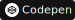

<section class="presentation">
  
  <h2>Hi 👋, I'm Sarudev!</h2>
  <h3>Known in the internet as Saru</h2>
  
</section>

<section class="about-me">
  <h1 class="title">💫 About me 💫</h1>
  

    <ul> 
      <li>🔭 I’m currently working on <b>some special projects...</b></li>
      <li>🌱 I’m currently learning <b>Spring Boot and Rust</b></li>
      <li>💬 Ask me about <b>React, JavaScript or Typescript</b></li>
      <li>⚡ Fun fact <b>I like mushroom-like short haired girls</b></li>
    </ul>
  

</section>

<section class="socials">
  <h1 class="title">🌐 Socials 🌐</h1>
  

    <ul>
      <li>
        
      </li>
      <li>
        
      </li>
      <li>
        
      </li>
      <li>
        
      </li>
      <li>
        
      </li>
    </ul>
  

</section>

<section class="tech-stack">
  <h1 class="title">💻 Tech Stack 💻</h1>
  

    
    
    
    
    
    
    
    
    
    
    
    
    
    
    
    
    
    
    
    
    
    
    
    
    
    
    
    
    
    
    
  

</section>

<section class="stats">
  <h1 class="title">📊 GitHub Stats 📊</h1>
  

    
    
    
  

</section>

